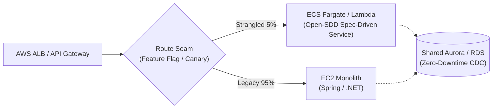

# Enterprise Brownfield SDD: The Zero-Trust Legacy Modernization Protocol

> **Target Audience**: Chief Architects, Engineering Directors, and Principal Engineers operating in Fortune 500 enterprises, regulated industries (banking, telecom, healthcare), and hyperscalers (AWS, GCP, Azure).

---

## 1. The Executive Problem: The "Legacy AI Trap"

By late 2026, empirical data across enterprise software engineering (METR, GitClear, DORA, NTT DATA) reveals an alarming reality:
- **Productivity–Reliability Paradox**: Unmonitored LLM coding tools cause a **19% slowdown** on mature enterprise codebases (METR RCT) and a **4x explosion in duplicated code blocks** (GitClear).
- **The "Big Bang Rewrite" Fallacy**: Generative AI tempting teams to attempt full rewrites of monolithic systems results in catastrophic project abandonment due to undocumented business invariants and edge cases.
- **The Context Window Fallacy**: Dumping a 2-million-line legacy repository into a 1M-token LLM context window causes catastrophic **token poisoning**, hallucinated internal APIs, and security boundary erosion (*Lost in the Middle* phenomenon).

**Open-SDD rejects naive generative rewrites.** In large enterprise systems and hyperscalers, Open-SDD attacks legacy codebases using a **Zero-Trust, Spec-Driven Strangler Protocol**:
> *"The legacy codebase defines existing behavior; the Living Specification defines intentional truth; automated characterization tests enforce invariants; and changes flow only through surgical, verified boundaries."*

---

## 2. The 5-Layer Brownfield Modernization Architecture

```mermaid
flowchart TD
    subgraph L1 ["Layer 1: Structural Reconnaissance (Zero-LLM Cost)"]
        Repo["Legacy Enterprise Codebase\n(Monolith / Microservices)"] --> AST["AST & Symbol Graph Extraction\n(Tree-Sitter / LSP / Static Analysis)"]
        AST --> Blast["Blast Radius & Call-Graph Calculation\n(Affected consumers, schemas, routes)"]
    end

    subgraph L2 ["Layer 2: Golden Characterization & Invariant Locking"]
        Blast --> AQE["Agentic QE Autonomous Fleet\n(agentic-qe.dev / PACTS)"]
        AQE --> Invariants["Metamorphic Invariant Suite\n+ Golden Characterization Baseline"]
    end

    subgraph L3 ["Layer 3: Living Spec Reverse-Engineering (/sdd-getspecs)"]
        Invariants --> GetSpecs["/sdd-getspecs [module-seam]"]
        GetSpecs --> Seeds["Unapproved Spec Seeds\n(brief.md + spec.json + EARS stubs)"]
        Seeds --> HITL{"Mandatory Human Gate (HITL)\nArchitect Review & EARS Calibration"}
        HITL --> ApprovedSpec["Approved Living Spec\n(requirements + design + tasks locked in Git)"]
    end

    subgraph L4 ["Layer 4: Transactional Surgical Implementation (/sdd-impl)"]
        ApprovedSpec --> Worktree["Ephemeral Git Worktree\n(Isolated context, Feature Flag / Strangler)"]
        Worktree --> TDD["Karpathy TDD Cycle\n(Red -> Green, Strict Boundary Enforcement)"]
        TDD --> Adversarial["sdd-review Adversarial Audit\n(Anti-hallucination, no unrequested changes)"]
    end

    subgraph L5 ["Layer 5: Enterprise Governance & Compliance (/sdd-audit)"]
        Adversarial --> ValGate["sdd-validate-impl Gate\n(Golden Baseline + Invariant Proofs)"]
        ValGate --> AuditReport["Immutable Compliance Ledger\n(EU AI Act Art. 11/12/14, NIST AI RMF, RTM)"]
        AuditReport --> Deploy["Zero-Downtime Deployment\n(Canary / Strangler Switch on Hyperscaler)"]
    end
```

---

## 3. Deep-Dive: The 5 Enterprise Attack Layers

### Layer 1: Structural Reconnaissance & AST Dependency Mapping (*Graph before Grep*)
**Anti-Pattern**: Asking an LLM to read 500 legacy files to "explain how the billing system works".
**The Open-SDD Enterprise Standard**:
1. **Deterministic Static Analysis**:
   - Extract the Abstract Syntax Tree (AST) using tree-sitter or language servers.
   - Build a directed dependency graph stored under `.sdd/memory/graph/` capturing:
     - Exported APIs, entrypoints, and route handlers.
     - Database schemas, ORM models, and migration histories.
     - External network boundaries and messaging queues (Kafka, SQS, Pub/Sub).
2. **Blast Radius Indexing**:
   - For any targeted module $M$, compute downstream dependencies:
     $$\text{BlastRadius}(M) = \{ c \in \text{Components} \mid c \rightsquigarrow M \}$$
   - If $\text{BlastRadius}(M) > \text{Threshold}$, Open-SDD blocks direct modification and mandates decomposition into smaller sub-seams.

---

### Layer 2: Golden Characterization Locking via Agentic QE
**The Principle**: In legacy code without comprehensive unit tests, existing code behavior is the specification of what the system *actually does* (including undocumented quirks and error handling).
1. **Autonomous Invariant Discovery**:
   - Open-SDD invokes **Agentic QE** (`agentic-qe.dev`) operating under the PACTS framework (Proactive, Autonomous, Collaborative, Targeted, Structured).
   - Generates characterization tests (Michael Feathers' pattern) capturing current I/O behavior without altering production logic.
2. **Metamorphic Invariant Generation**:
   - Properties that must remain invariant (e.g. `Price(order) == Subtotal + Tax - Discount`, transaction idempotency) are formalized as property tests.
3. **The Regression Anchor**:
   - Characterization tests are committed to Git. If any subsequent AI refactoring causes an unapproved behavior deviation, the build breaks immediately.

---

### Layer 3: Living Spec Reverse-Engineering (`/sdd-getspecs`) & Human Gate
**Anti-Pattern**: Letting an AI reverse-engineer a spec and automatically approve it.
**The Open-SDD Enterprise Standard**:
1. **Deduce Seeds, Never Premature Approvals**:
   - `/sdd-getspecs` ingests the codebase structure, git forensics, and module seams.
   - Generates:
     - `.sdd/steering/product.md`, `tech.md`, `structure.md`: Architectural invariants and conventions.
     - `.sdd/steering/roadmap.md`: Dependency-ordered backlog of bounded feature specifications.
     - `.sdd/specs/<feature>/brief.md`: Grounded in real file paths and legacy touchpoints.
     - `.sdd/specs/<feature>/spec.json`: Initialized with `phase: "initialized"` and **all approvals strictly `false`**.
     - `.sdd/specs/<feature>/requirements.md`: Stub only; EARS criteria remain intentionally empty.
2. **Human-in-the-Loop (HITL) Regulatory Review**:
   - The enterprise architect or lead engineer reviews the brief and runs `/sdd-spec-requirements <feature>`.
   - The team formally approves:
     - Which legacy behaviors are **preserved as invariants**.
     - Which legacy behaviors are **explicitly modified or retired**.
   - The spec is locked via `/sdd-spec-design` and `/sdd-spec-tasks`.

---

### Layer 4: Transactional Surgical Implementation & The Strangler Pattern
**The Strategy**: Never perform in-place surgery on high-risk legacy code. Apply Martin Fowler’s **Strangler Fig Pattern** combined with Open-SDD subagent isolation:
1. **Ephemeral Git Worktrees**:
   - `/sdd-impl` operates inside dedicated Git worktrees. The main development branch is never polluted with intermediate speculative code.
2. **Feature Flags & Dark Launch**:
   - All new or refactored code paths sit behind feature flags (LaunchDarkly, AWS AppConfig, Unleash) or routing proxies (API Gateway / Envoy).
3. **Karpathy Guidelines Enforced**:
   - *Surgical Changes*: The agent's prompt strictly forbids touching code outside `_Boundary:_`.
   - *Simplicity First*: Zero premature abstractions.
   - *Independent Adversarial Review (`sdd-review`)*: A dedicated reviewer subagent checks the diff against the approved spec and characterization baseline before accepting any task.

---

### Layer 5: Enterprise Governance & Compliance Ledger (`/sdd-audit`)
In hyperscalers and regulated enterprises, untraced code modifications violate compliance:
1. **Requirements Traceability Matrix (RTM)**:
   - Links every modified line of code back to:
     $$\text{Code Commit} \longleftrightarrow \text{Test Evidence} \longleftrightarrow \text{Task ID} \longleftrightarrow \text{ADR} \longleftrightarrow \text{EARS Requirement ID}$$
2. **Regulatory Compliance Alignment**:
   - **EU AI Act (Article 11)**: Complete technical documentation of AI-assisted engineering.
   - **EU AI Act (Article 12)**: Tamper-evident Git logs and session provenance.
   - **EU AI Act (Article 14)**: Verification of genuine human oversight (non-bypassable review gates).
   - **NIST AI RMF (GOVERN & MAP)**: Verifiable risk containment boundaries.

---

## 4. Hyperscaler Deployment Architecture Patterns

### Pattern A: AWS Modernization (Legacy ECS/EC2 Monolith $\rightarrow$ Serverless / Containers)

- **Execution**:
  1. `/sdd-getspecs` extracts the interface contract of the legacy endpoint.
  2. Characterization tests are executed against the legacy endpoint to record payload invariants.
  3. New microservice is specified, validated, and implemented with `/sdd-impl`.
  4. ALB weighted routing shifts 1% $\to$ 5% $\to$ 100% traffic with automatic rollback if invariant tests deviate.

### Pattern B: GCP / Azure Big Data & Microservices Pipeline
- **GCP Cloud Run / Azure Container Apps**:
  - Independent subagent waves deploy new transactional services alongside legacy clusters.
  - Open-SDD verifies Kafka / Eventarc schemas through metamorphic schema validation before authorizing traffic cutover.

---

## 5. Enterprise Brownfield Checklist for Architects

Before authorizing an AI agent to execute on a brownfield codebase:

- [ ] **No Context Dumps**: Repository scanned via AST / graph indexing (`.sdd/memory/graph/`); context scoped strictly to target seam.
- [ ] **Characterization Suite Locked**: Golden tests committed to Git before code modification.
- [ ] **Spec Approved by Human**: `spec.json` has `phase: "approved"` with signed-off EARS requirements.
- [ ] **Strict Git Mode Active**: Feature branch created (`feat/<slug>`), spec committed before implementation.
- [ ] **Feature Flag Guard**: New code deployed dark behind a feature flag or strangler proxy.
- [ ] **Audit Report Generated**: `/sdd-audit` passes with 100% requirements coverage and zero unregistered drift.
