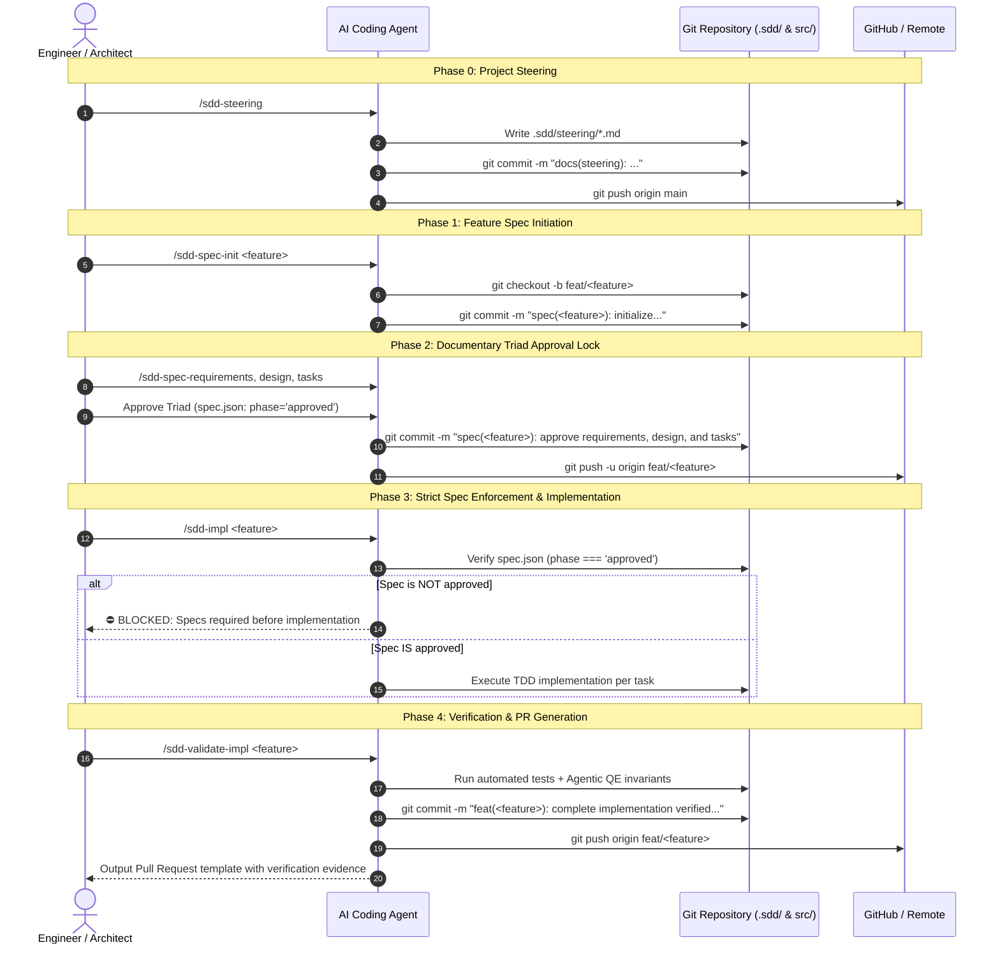

# Strict Git Mode & SpecOps Workflow Guide

> "Let specs be the single source of truth. Allow implementation to flow only from approved specifications, validated rigorously and committed immutably."

## Overview

In traditional software development, Git tracks code while specifications remain scattered across wikis, issue trackers, or chat histories. Over time, code and specifications inevitably drift apart.

Open-SDD's **Strict Git Mode** (*SpecOps*) bridges this divide by making specifications **living source code** in Git:
- Specifications reside in `.sdd/specs/<feature>/`.
- Every SDLC phase gate is tied to deterministic Git actions: branch creation, spec approval commit/push, and implementation validation commit/push.
- Generative coding without an approved specification is strictly blocked.

---

## Configuration (`.sdd/settings/git.json`)

Configure Git automation behavior in your project:

```json
{
  "$schema": "https://json-schema.org/draft/2020-12/schema",
  "mode": "strict",
  "branch_prefix": "feat/",
  "steering_branch": "main",
  "auto_branch": true,
  "auto_commit": true,
  "auto_push": true,
  "require_approved_spec": true,
  "commit_conventions": {
    "steering": "docs(steering): establish architecture and technical standards",
    "spec_init": "spec({{feature}}): initialize feature specification seed",
    "spec_approved": "spec({{feature}}): approve requirements, design, and tasks breakdown",
    "impl_complete": "feat({{feature}}): complete implementation verified against spec"
  }
}
```

### Operational Modes
- `strict` (Recommended for Enterprise): Code generation is strictly forbidden without approved specs. Automatically branches, commits, and pushes at each phase gate.
- `assisted`: The AI generates exact Git commands and prompts for human confirmation before executing.
- `off`: Manual Git management; Open-SDD writes files to disk without invoking Git commands.

---

## The 4 Git Milestones



---

## Best Practices & Enterprise Compliance

1. **Specs Never Drift**: Because `spec(<feature>): approve...` precedes `feat(<feature>): implement...`, the Git commit history provides an immutable audit trail proving that architecture preceded implementation.
2. **Regulatory Traceability (EU AI Act & NIST AI RMF)**: Auditors can trace any code diff directly to its parent spec commit and human sign-off hash.
3. **Brownfield Safe**: When using `/sdd-getspecs`, existing codebases are reverse-engineered into *unapproved seeds*. Implementation cannot touch legacy modules until human review formally approves the seed.
