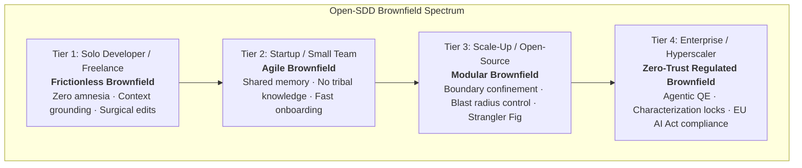

# Universal Brownfield with Open-SDD: From Solo Developers to Hyperscalers

> **The Reality of Software Engineering**: Over 90% of all real-world development is **Brownfield**. Greenfield projects are the exception; existing code is the rule.

Whether you are a solo developer working on a side project or client repository, an agile startup moving fast without breaking things, or a Fortune 500 bank running on AWS, GCP, or Azure, **Open-SDD provides an adaptive, progressive path to brownfield modernization**.

---

## The Spectrum: One Protocol, Four Tiers of Scale

Open-SDD scales up and down. It never forces enterprise bureaucracy on a solo hacker, nor does it cut corners on a regulated banking core.



---

## Tier 1: Solo Developer & Freelancer (*Frictionless Brownfield*)

### The Problem
* You open a project you haven't touched in 6 months, or inherit a client repository.
* When you ask an AI agent to add a feature, it hallucinates libraries you don't use, rewrites working code, or destroys existing patterns.
* You don't want 20 pages of documentation; you just want the agent to **understand the code, not break anything, and add the feature cleanly**.

### The Open-SDD Flow
```bash
# 1. Inspect existing code and extract project conventions in 30 seconds:
/sdd-getspecs

# 2. Open-SDD creates .sdd/steering/ (tech.md, structure.md) grounded in reality.
# The AI now knows your exact framework, routing, and style.

# 3. Create and implement a new feature surgically:
/sdd-spec-quick stripe-checkout --auto
```

### Why it transforms solo work:
* **Eradicates AI Hallucinations**: The agent reads `.sdd/steering/` and knows your real tech stack.
* **Surgical Precision**: Karpathy Guidelines ensure the agent edits only what is necessary, without unintended file rewrites.
* **Zero Overhead**: With `--auto` or fast-track `-y`, you get the safety of specifications without manual paperwork.

---

## Tier 2: Startups & Small Teams (*Agile Brownfield / Anti-Debt*)

### The Problem
* The MVP was coded in a hackathon frenzy. Now changes in the user service silently break billing.
* "Tribal knowledge": Only the founding engineer knows how authentication was built. When they take time off, velocity grinds to a halt.
* Onboarding a new hire takes 3 weeks of reading messy code.

### The Open-SDD Flow
```bash
# 1. Reverse engineer the existing services:
/sdd-getspecs src/services

# 2. Check the living roadmap generated in .sdd/steering/roadmap.md:
# Prioritizes technical debt and module boundaries.

# 3. Spec and implement new features with team reviews:
/sdd-spec-requirements auth-v2
/sdd-spec-design auth-v2
/sdd-spec-tasks auth-v2
/sdd-impl auth-v2 --review required
```

### Why it transforms startups:
* **Eliminates Bus Factor**: Project architecture is documented as living code in `.sdd/steering/` and `.sdd/specs/`.
* **Day-1 Onboarding**: New developers run `/sdd-spec-status` and read `.sdd/steering/` to understand the full system in 15 minutes.
* **Independent Review**: Every task runs with `sdd-review`, catching regressions before code reaches pull requests.

---

## Tier 3: Scale-Ups & Open Source (*Modular Modernization*)

### The Problem
* A growing monolith with tightly coupled modules.
* Developers are afraid to refactor shared utilities because they don't know who calls them.
* PRs are huge, hard to review, and create frequent merge conflicts.

### The Open-SDD Flow
```bash
# 1. Analyze blast radius and dependencies before changing code:
/sdd-validate-gap search-indexer

# 2. Define strict boundaries in design.md:
# Tasks are explicitly annotated with _Boundary:_ and _Depends:_

# 3. Autonomous multi-task execution in isolated Git branches:
/sdd-impl search-indexer
```

### Why it transforms scale-ups:
* **Boundary Confinement**: Subagents are strictly restricted by `_Boundary:_` annotations to designated files.
* **Strangler Fig Pattern**: Incrementally replace legacy modules with modern interfaces behind feature flags.
* **Transparent Diff Reviews**: Reviewers evaluate diffs against spec criteria, not just syntax.

---

## Tier 4: Enterprise & Hyperscalers (*Zero-Trust Regulated Brownfield*)

### The Problem
* Multi-million line legacy systems running core banking, insurance, or cloud infrastructure.
* Strict regulatory compliance: **EU AI Act (Articles 11, 12, 14)**, **NIST AI RMF**, **SOC 2**, and **ISO/IEC 42001**.
* Catastrophic cost of failure: Even a 0.01% bug in production causes financial loss or legal liability.

### The Open-SDD Flow
```bash
# 1. AST Dependency Reconnaissance (Tree-Sitter / LSP graph):
/sdd-getspecs core-transaction-engine

# 2. Golden Characterization Locking with Agentic QE (agentic-qe.dev):
# Locks current behavior B0 with black-box and metamorphic invariant suites.

# 3. Strict Git Mode Gate 0 (Human sign-off mandatory):
# spec.json phase: "approved" is required. Git hooks reject unauthorized commits.

# 4. Surgical Implementation with PACTS verification:
/sdd-impl core-transaction-engine --review required

# 5. Full Regulatory Audit & Traceability Matrix:
/sdd-audit core-transaction-engine --regulatory
```

### Why it satisfies enterprise risk:
* **Zero-Trust AI**: No unapproved code can be committed or merged (enforced by Strict Git Mode and Gate 0).
* **Deterministic Traceability**: Every code change links to `Task ID` $\leftrightarrow$ `ADR` $\leftrightarrow$ `EARS Requirement` $\leftrightarrow$ `QE Evidence`.
* **Agentic QE Fleets**: Autonomous quality engineering validates invariants at scale.

---

## Summary Matrix: Tailoring Open-SDD to Your Scale

| Dimension | Tier 1: Solo Dev | Tier 2: Startup | Tier 3: Scale-Up | Tier 4: Enterprise |
|---|---|---|---|---|
| **Primary Goal** | Grounding & surgical speed | Shared memory & velocity | Decoupling & boundaries | Zero-Trust & compliance |
| **Bootstrapping** | `/sdd-getspecs` (quick) | `/sdd-getspecs` (per module) | `/sdd-getspecs` + `/sdd-validate-gap` | Full AST graph + Blast Radius |
| **Testing Focus** | Existing unit tests | Unit + integration tests | Integration + boundary tests | Metamorphic PACTS (Agentic QE) |
| **Approval Flow** | Fast-track (`-y`, `--auto`) | Tech lead / peer review | Pull request spec approval | Strict Git Mode + Human Gate 0 |
| **Audit Requirement** | None (lean) | Changelog / PR history | ADR tracking | `/sdd-audit` (EU AI Act / NIST) |
| **Agent Platforms** | Cursor, Claude, Copilot | Claude Code, Windsurf, Codex | All 8 agents supported | Multi-agent fleets / Antigravity |

---

## Getting Started on Any Existing Project

No matter the size of your project:

```bash
# Step 1: Install Open-SDD in your project
npx @brujo2020/open-sdd@latest

# Step 2: Bootstrap from your existing codebase
/sdd-getspecs

# Step 3: Start building safely
/sdd-spec-requirements my-next-feature
```
